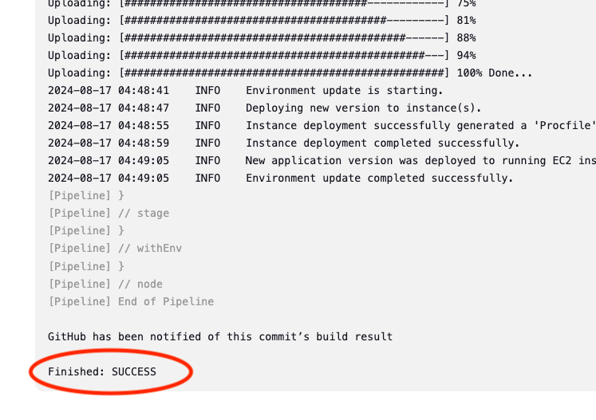
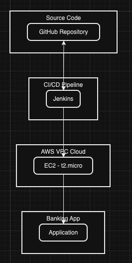

Purpose

This workload focuses on automating the deployment process by integrating AWS CLI into a Continuous Integration/Continuous Deployment (CI/CD) pipeline. This workload aims to automate the pipeline, improving efficiency and reducing the risk of human error.

## Steps Taken:

1.**Cloning the Repository**   - Cloned the class repository to my own GitHub account to maintain version control and track changes.

2.**Creating AWS IAM Access Keys**   - Created AWS IAM access keys to securely connect and authenticate with AWS CLI. These keys are essential for accessing AWS resources programmatically. They must be securely stored to prevent unauthorized access, which could lead to severe security breaches.

3.**Creating an EC2 Instance for Jenkins**   - Set up a t2.micro EC2 instance to host the Jenkins server, which manages the CI/CD pipeline. The server was configured to support automated builds and deployments.

4.**Creating a System Resources Bash Script**   - Developed a Bash script (`system_resources_test.sh`) to monitor CPU usage.

5.**Setting Up GitHub Access**   - Configured GitHub access on the Jenkins server and securely stored the Personal Access Token on the AWS instance (not in the repository). This ensures that changes can be pushed to the repository without exposing sensitive credentials.

6.**Setting Up a MultiBranch Pipeline in Jenkins**   - Connected the GitHub repository to Jenkins using a MultiBranch Pipeline, enabling automatic builds triggered by changes to any branch.

7.**Installing AWS CLI on the Jenkins Server**   - Installed AWS CLI on the Jenkins server to enable interaction with AWS services. This step required updating the server and installing necessary packages like `unzip`.

8.**Configuring the Jenkins User**   - Created and configured a password for the `jenkins` user, granting it the necessary permissions by modifying the sudoers file.

9.**Activating the Python Virtual Environment**   - Navigated to the Jenkins workspace and activated a Python Virtual Environment. This environment isolates dependencies, ensuring consistent behavior across different environments.

10.**Installing AWS Elastic Beanstalk CLI**    - Installed and initialized the AWS Elastic Beanstalk CLI to manage the deployment of applications. Configured it to use the `us-east-1` region and the appropriate environment settings.

11.**Editing the Jenkinsfile**    - Modified the Jenkinsfile to include a "Deploy" stage that uses `eb deploy` for deploying the application to AWS Elastic Beanstalk. This stage was added after ensuring that the build stage properly creates and activates the Python virtual environment.

12.**Building and Deploying the Application**    - Pushed changes to GitHub, built the pipeline in Jenkins, and successfully deployed the application to AWS Elastic Beanstalk. Issues with the branch detachment were resolved by switching back to the main branch. CHeck the log files to confirm the pipeline was successful.

**Draw.IO:**

**  

## System Design Diagram

**Draw.IO:**

**  

## Troubleshooting

1.**Jenkins User Permissions**   - The `jenkins` user could not use `sudo` commands. This was resolved by adding the `jenkins` user to the sudoers file.

2.**Branch Detachment**   - Encountered a branch detachment issue while pushing changes. This was resolved by switching to the main branch and using a GitHub token for authentication.

3.**Cannot Find Script**   - Make sure the file is located in the correct directory and that the path is correct.

4.**Elastic BeanStalk Already Present**   - Change the Jenkinsfile from  `eb create` to  `eb deploy`. Make sure to remove the  `--single` from this line as well.

## Optimization

Using a deploy stage in the CI/CD pipeline significantly increases business efficiency by automating the deployment process. This reduces the time and effort required for manual deployments, ensuring consistent and reliable releases. However, automating deployments to production environments can introduce risks such as deploying untested code. To mitigate this, it’s essential to implement thorough testing stages and require manual approval before deploying to production.

## Conclusion

This workload provided hands-on experience with automating the deployment process using AWS CLI, Jenkins, and Elastic Beanstalk. By integrating these tools into a CI/CD pipeline, we can streamline deployments, reduce errors, and improve overall efficiency.
